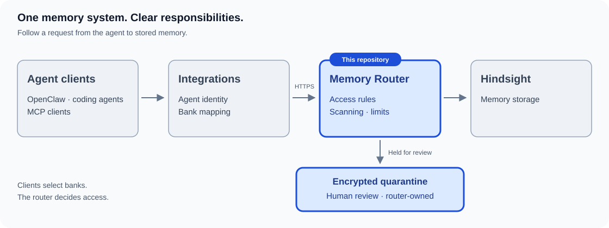

# Memory Router

[](https://github.com/mickey-kras/hindsight-memory-router/actions/workflows/ci.yml)
[](https://github.com/mickey-kras/hindsight-memory-router/actions/workflows/ci.yml)
[](https://github.com/mickey-kras/hindsight-memory-router/actions/workflows/codeql.yml)
[](https://scanaislop.com/mickey-kras/hindsight-memory-router)
[](https://github.com/mickey-kras/hindsight-memory-router/actions/workflows/publish.yml?query=branch%3Amain)
[](https://hub.docker.com/r/mickeykrasilnikov/hindsight-memory-router)
[](LICENSE)

Memory Router controls access to [Hindsight](https://github.com/vectorize-io/hindsight) memory banks for OpenClaw and compatible clients. It authenticates callers, limits requests, scans memory content and quarantines unsafe content with encryption. Use it to give agents separate write banks and selected shared reads without exposing Hindsight directly.

Hindsight is the only supported backend.

## How it fits together

[](https://mickey-kras.github.io/hindsight-memory-router/)

[Explore the architecture and request flows](https://mickey-kras.github.io/hindsight-memory-router/) · [Integrations repository](https://github.com/mickey-kras/hindsight-memory-router-integrations)

## Install and start

Requires Docker Compose, OpenSSL and a reachable Hindsight service. Download or check out this repository, then work from its root.

1. On a trusted admin machine, create a quarantine keypair:

```sh
umask 077
openssl genpkey -algorithm RSA -pkeyopt rsa_keygen_bits:4096 -out quarantine-private.pem
openssl pkey -in quarantine-private.pem -pubout -out quarantine-public.pem
base64 < quarantine-public.pem | tr -d '\n'
```

2. Keep the private key in secure off-host storage. Put only the base64 public key in the deployment's `.env` as `QUARANTINE_PUBLIC_KEY`. Configure `HINDSIGHT_BASE_URL` if Hindsight is not reachable at `http://hindsight:8888` on the Compose network. Compose does not start Hindsight.
3. Start the router and check readiness:

```sh
docker compose up -d
curl --fail http://localhost:8890/health/ready
```

A successful readiness check means router storage and Hindsight are reachable. Compose builds the image and stores SQLite state in a named volume. The published port is loopback-only.

## Connect an agent

Configure [principal credentials and bank grants](docs/security/authentication.md) using the [Compose registry mount](docs/deployment/docker.md#principal-registry), then follow [OpenClaw setup](docs/integrations/openclaw.md). Router and admin operations fail closed until credentials are configured.

The integration requires HTTPS. Add a [TLS terminator](docs/deployment/docker.md#network-exposure-and-tls) before connecting it or exposing the router beyond the host. Plain HTTP upstreams are accepted only for private hosts; set `HINDSIGHT_REQUIRE_SECURE_TRANSPORT=true` to require HTTPS for every upstream.

## Documentation

- [Getting started](docs/getting-started.md) and [configuration](docs/configuration.md)
- [Docker deployment and upgrades](docs/deployment/docker.md)
- [Quarantine review](docs/operations/quarantine-review.md) and [security](SECURITY.md)
- [All documentation](docs/README.md), including API, architecture, operations and releases

[MIT license](LICENSE) | [Third-party notices](THIRD_PARTY_NOTICES.md).

