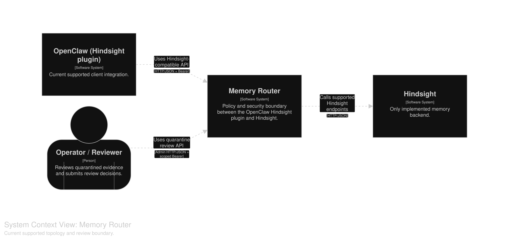
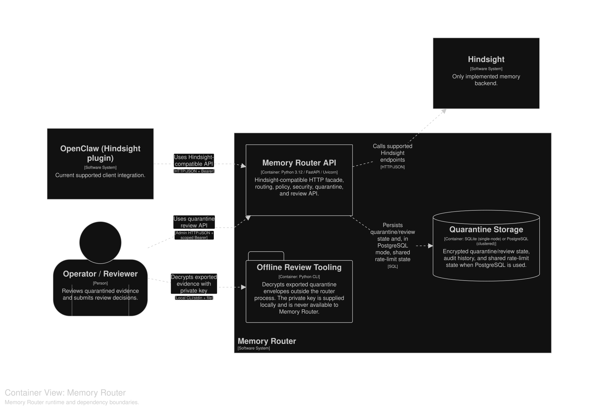
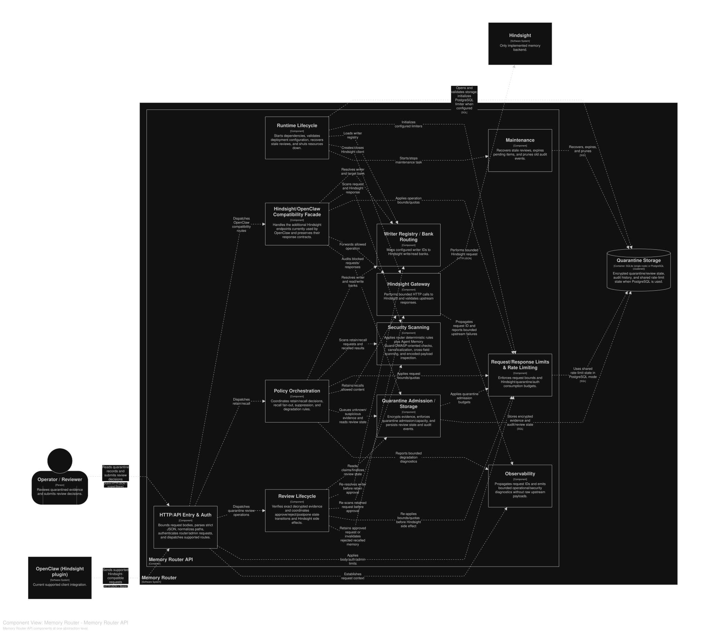

# Architecture

Canonical model: [`workspace.dsl`](workspace.dsl)  
Interactive model: [GitHub Pages](https://mickey-kras.github.io/hindsight-memory-router/)

C1–C3, dynamic, and deployment views are architecture-as-code maintained in `workspace.dsl`. Structurizr validates and renders that model; it does not infer architecture from Python. Architecture-affecting runtime changes must update the DSL in the same PR. Files under `generated/` are generated; do not hand-edit them.

## C1 — System Context

Who uses Memory Router and which external systems it talks to.



## C2 — Containers

Runtime processes and data stores.



## C3 — Components

Responsibilities inside Memory Router API.



## Dynamic views

- [Startup / shutdown](generated/StartupShutdown.svg)
- [Retain](generated/Retain.svg)
- [Recall](generated/Recall.svg)
- [Quarantine / review](generated/QuarantineReview.svg)

## Deployment

- [Single-node + SQLite](generated/SingleNode.svg)
- [Clustered + PostgreSQL](generated/Clustered.svg)

## Updating

```bash
make architecture
```

Requires Docker. `make architecture-site` builds the uncommitted static site used by GitHub Pages.
