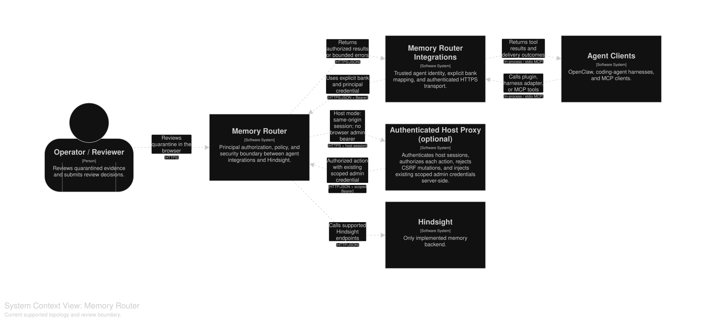
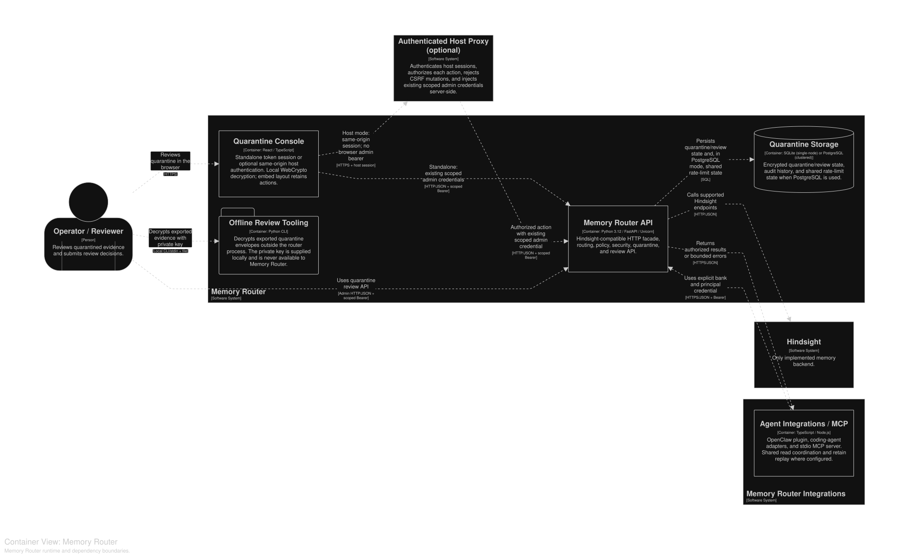
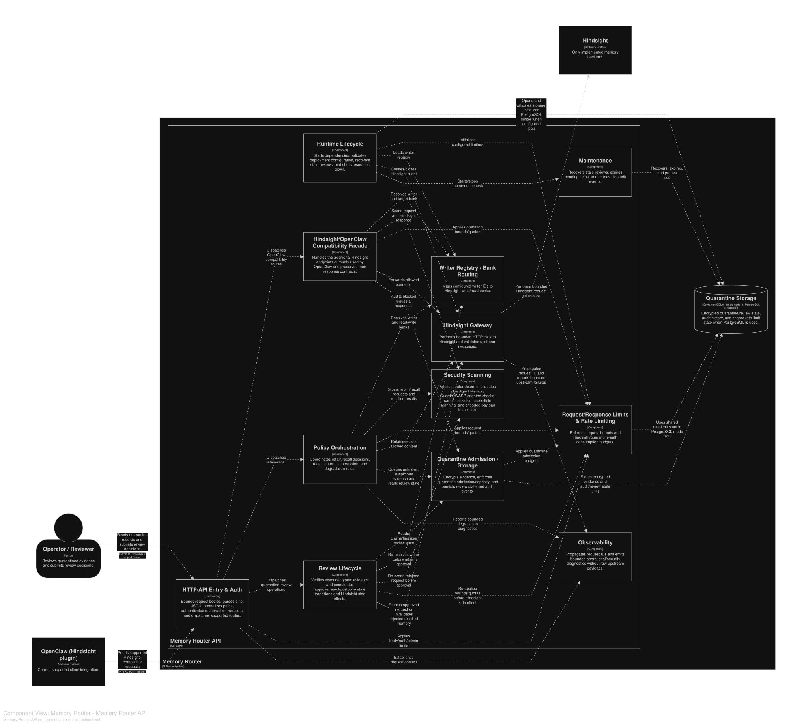

# Architecture

[Documentation](../README.md) | [Repository](../../README.md)

Canonical model: [`workspace.dsl`](workspace.dsl)  
Interactive architecture: [Structurizr site](https://mickey-kras.github.io/hindsight-memory-router/)

C1 to C3, dynamic, and deployment views are architecture-as-code maintained in `workspace.dsl`. Structurizr validates and renders that model; it does not infer architecture from Python. Architecture-affecting runtime changes must update the DSL in the same PR. Files under `generated/` are generated; do not hand-edit them.

Dynamic views cover principal authorization, client coordination, routing, policy, security and review workflows. Health/version endpoints stay in the structural and API references. The model stops at C3.

## README overview

The two README diagrams share one topology and highlight the owning repository. Generate both with `python3 scripts/architecture-overview.py`; copy `overview-integrations.svg` to the integrations repository as `docs/architecture-overview.svg`. `make architecture` also refreshes them. These small views deliberately omit deployment details.

[](https://mickey-kras.github.io/hindsight-memory-router/)

## C1: System Context

Who uses Memory Router and which external systems it talks to.



## C2: Containers

Runtime processes and data stores.



## C3: Components

Responsibilities inside Memory Router API.



## Dynamic views

- [Principal authorization](generated/PrincipalAuthorization.svg): authenticate credentials and check bank/scope grants before memory access.
- [Integration reads](generated/IntegrationReads.svg): client fan-out, shared budget, partial results, and authorization failure handling.
- [Retain queue / replay](generated/RetainReplay.svg): transient outage queuing and current write-bank checks.
- [Retain](generated/Retain.svg)
- [Recall](generated/Recall.svg)
- [Compatibility operations](generated/CompatibilityOperations.svg): shared flow for supported bank/config/mental-model/reflect operations used by the integrations.
- [Quarantine / review](generated/QuarantineReview.svg): local decryption, decision outcomes, and side-effect reconciliation.
- [Startup / shutdown](generated/StartupShutdown.svg)

### Implementation boundaries

Principal-mode requests authorize the explicit bank and operation scope. Legacy writer mode maps writer IDs to banks; its server-side recall fan-out is separate from client-side multi-bank coordination. The client mapping never grants server access.

Integration retain queues hold **plaintext transcripts on the agent host**. They are separate from the router's encrypted quarantine. OpenClaw and the MCP adapter use the shared coordinator where configured; coding-agent adapters also have harness-specific capture and cursor behavior.

Review approval of a retained request rechecks its original destination and current grant, then writes to Hindsight. Approval of a recalled memory allows that reviewed memory without another retain; rejection invalidates it. Rejecting a retained request does not write it. Postpone defers review. After an ambiguous side effect, an operator verifies Hindsight and reconciles the current snapshot; the router does not blindly replay the operation. See [review operations](../operations/quarantine-review.md).

These flows are grounded in `memory_router/principal_gate.py`, `request_dispatch.py`, `policy.py`, and `admin.py`; client flows follow the integrations repository's `src/shared/recall-coordinator.ts`, `retain-coordinator.ts`, and `src/mcp/server.ts`.

## Deployment

- [Single-node + SQLite](generated/SingleNode.svg)
- [Clustered + PostgreSQL](generated/Clustered.svg)

## View names

The interactive site uses explicit human-facing prefixes:

- `C1:`, `C2:`, `C3:` for the formal C4 hierarchy.
- `Dynamic:` for runtime interaction views.
- `Deployment:` for deployment views.

The static site opens on System Context when no view is linked and adds a persistent view selector; Structurizr's built-in quick navigation remains available with `Space`.

## Updating

```bash
make architecture
```

Requires Docker. `make architecture-site` builds the uncommitted static site used by GitHub Pages.

