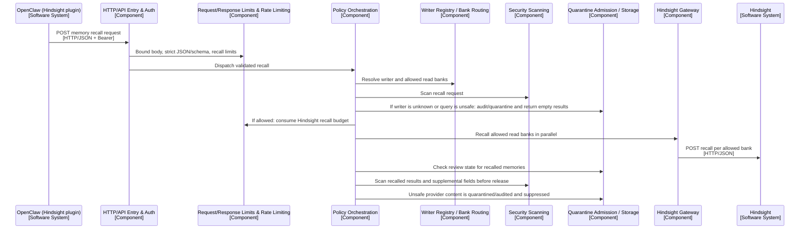

<!-- Generated from ../workspace.dsl by make architecture. Do not edit. -->

```mermaid
sequenceDiagram

  participant 2 as OpenClaw (Hindsight plugin)<br />[Software System]
  participant 7 as HTTP/API Entry & Auth<br />[Component]
  participant 12 as Request/Response Limits & Rate Limiting<br />[Component]
  participant 10 as Policy Orchestration<br />[Component]
  participant 9 as Writer Registry / Bank Routing<br />[Component]
  participant 11 as Security Scanning<br />[Component]
  participant 14 as Quarantine Admission / Storage<br />[Component]
  participant 13 as Hindsight Gateway<br />[Component]
  participant 3 as Hindsight<br />[Software System]

  2->>7: POST memory recall request<br />[HTTP/JSON + Bearer]
  7->>12: Bound body, strict JSON/schema, recall limits
  7->>10: Dispatch validated recall
  10->>9: Resolve writer and allowed read banks
  10->>11: Scan recall request
  10->>14: If writer is unknown or query is unsafe: audit/quarantine and return empty results
  10->>12: If allowed: consume Hindsight recall budget
  10->>13: Recall allowed read banks in parallel
  13->>3: POST recall per allowed bank<br />[HTTP/JSON]
  10->>14: Check review state for recalled memories
  10->>11: Scan recalled results and supplemental fields before release
  10->>14: Unsafe provider content is quarantined/audited and suppressed
```
