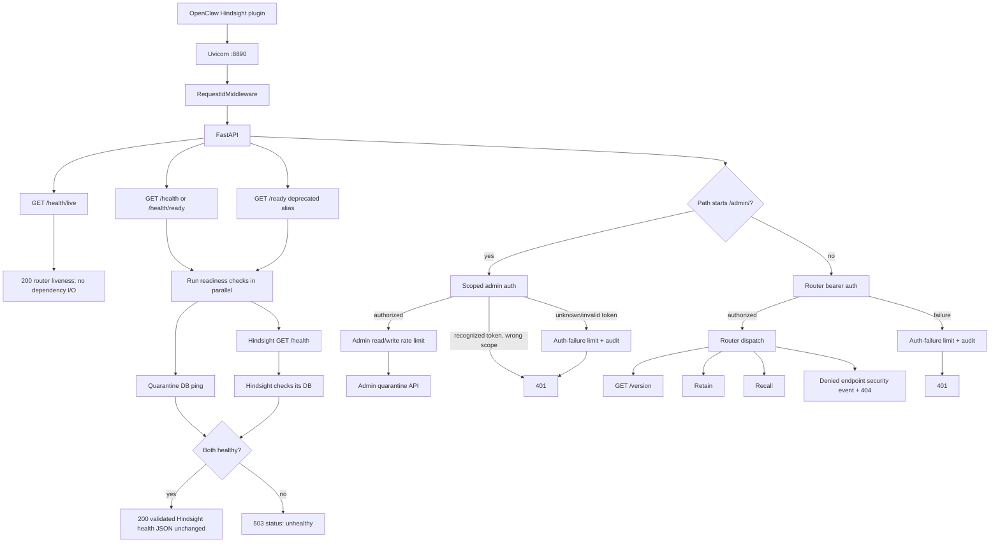
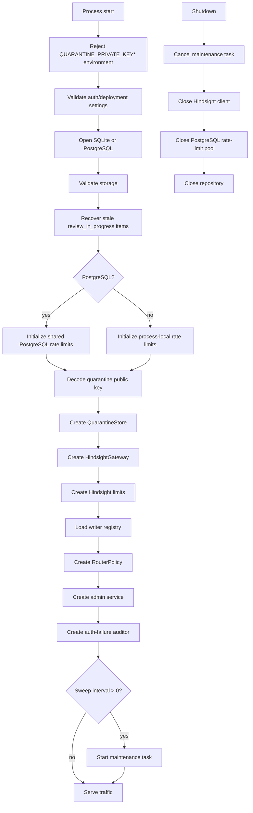
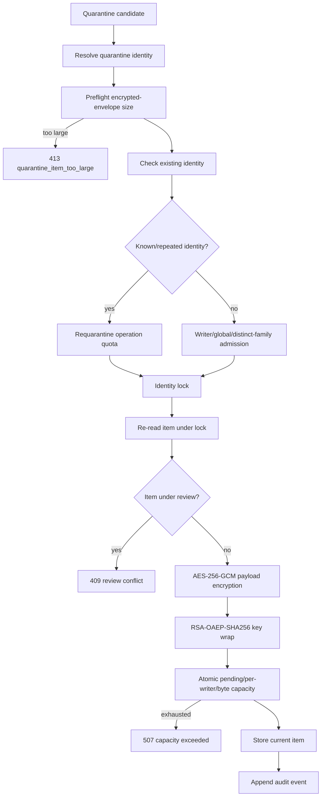
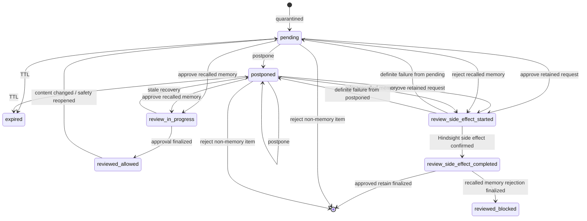
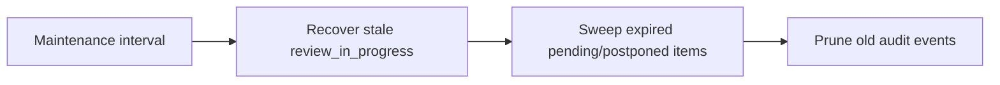
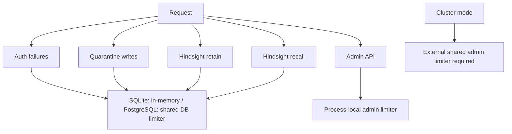
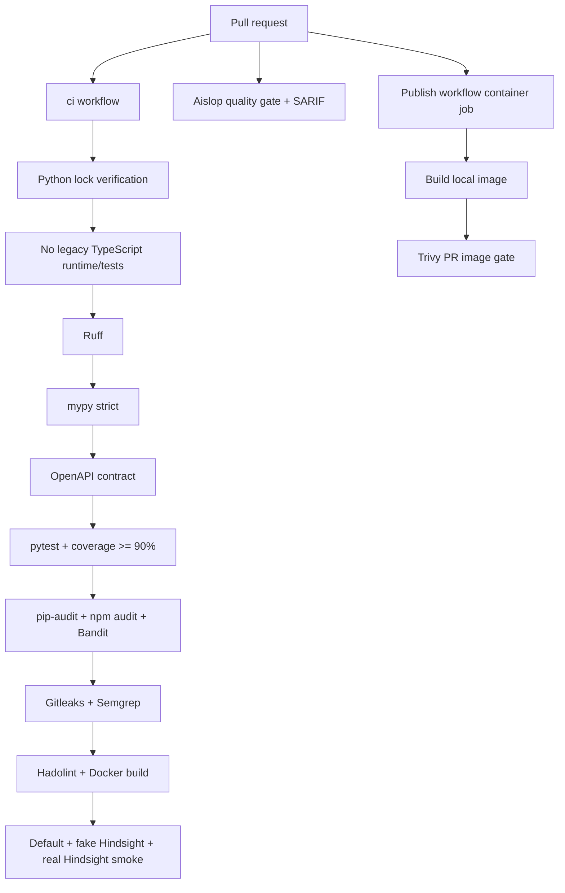
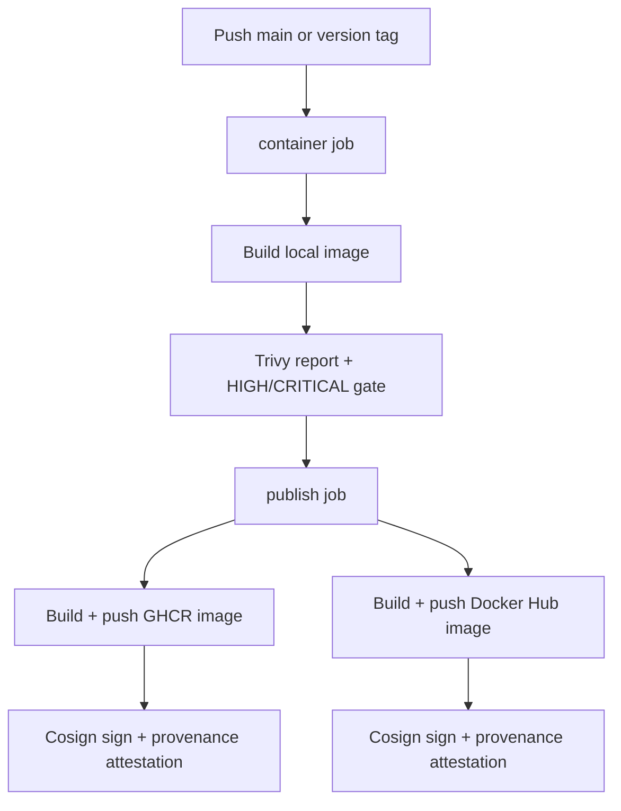

# Runtime interaction map

This document describes the current runtime behavior of Memory Router. It is intended to be the as-built reference for request routing, security decisions, quarantine, review state, maintenance, and Hindsight interaction.

## Request entry



Health endpoints are unauthenticated. `/health/live` is router-process liveness only. `/health` and `/health/ready` are exact readiness aliases: they require both router quarantine storage and Hindsight `/health` to succeed. The legacy `/ready` endpoint is deprecated and uses the same readiness behavior. A successful readiness response is the validated Hindsight `/health` JSON returned unchanged; dependency failure returns `503 {"status":"unhealthy"}`.

`RequestIdMiddleware` accepts a valid incoming `X-Request-ID` or generates one. The request ID is returned to the client and forwarded to Hindsight.

## Startup and shutdown



Cluster mode requires PostgreSQL quarantine storage and an external shared admin rate limiter. SQLite and in-memory rate limits are single-process only.

## Retain

```mermaid
flowchart TD
    Req[POST /v1/default/banks/{writer}/memories] --> Body[Bound request body]
    Body --> JSON[Strict JSON + max nesting depth]
    JSON --> Validate[Validate RetainBody]
    Validate --> Bounds[Retain item/string byte bounds]
    Bounds --> Writer{Writer registered?}

    Writer -->|no| Unknown[Quarantine retain_request: unknown_writer]
    Unknown --> Queued[Return queued + quarantine_id]

    Writer -->|yes| Scan[Scan all string keys and values]
    Scan --> Safe{Safe?}
    Safe -->|no| Suspicious[Quarantine retain_request: suspicious_content]
    Suspicious --> Queued

    Safe -->|yes| Rewrite[Inject router provenance metadata]
    Rewrite --> Rate[Consume writer + global retain quota]
    Rate --> Hindsight[POST assigned Hindsight write bank]
    Hindsight --> Response[Return Hindsight response]
```

The security scan includes canonicalization, deterministic router rules, Agent Memory Guard detectors, rolling cross-field scans, and direct/split Base64 inspection.

Unknown or suspicious requests do not consume normal Hindsight retain quota.

## Recall

```mermaid
flowchart TD
    Req[POST .../{writer}/memories/recall] --> Parse[Bound body + strict JSON + schema]
    Parse --> Bounds[Query/max_tokens bounds]
    Bounds --> Writer{Writer registered?}

    Writer -->|no| QU[Attempt quarantine: unknown_writer]
    QU --> EmptyU[Return results: []]

    Writer -->|yes| Scan[Scan all recall request strings/keys]
    Scan --> SafeQ{Safe?}
    SafeQ -->|no| QS[Attempt quarantine: suspicious_query]
    QS --> EmptyS[Return results: []]

    SafeQ -->|yes| Limit[Consume writer + global recall quota]
    Limit --> Fanout[Recall all allowed read banks in parallel]

    Fanout --> Validate[Per-bank HTTP/size/JSON/depth/shape validation]
    Validate -->|typed Hindsight failure| Drop[Log degradation and drop bank]
    Validate -->|valid| Results[Process recalled results]

    Results --> State[Lookup quarantine state by bank + memory id]
    State --> Blocked{Blocked or review state?}
    Blocked -->|yes| Suppress[Suppress result]

    Blocked -->|no| Approved{reviewed_allowed and id+text digest unchanged?}
    Approved -->|yes| Volatile[Scan volatile fields only]
    Volatile -->|safe| Return[Return result]
    Volatile -->|unsafe| Quarantine[Quarantine/reopen and suppress]

    Approved -->|no| Full[Scan full recalled result]
    Full -->|safe| Return
    Full -->|unsafe| Quarantine

    Quarantine --> QResult{Quarantine available?}
    QResult -->|yes| Suppress
    QResult -->|capacity/rate/review conflict| Degrade[Log degradation]
    Degrade --> Suppress
```

A typed Hindsight failure affects only the failing read bank. If all banks fail, recall returns an empty result set. Suspicious recalled material is suppressed even when quarantine cannot accept it.

## Quarantine admission



`quarantine_items` stores current quarantine/review state. `quarantine_events` stores audit history.

## Review lifecycle



### Retain approval

```text
offline decrypt
-> exact canonical SHA + metadata verification
-> writer must exist
-> parse original retain again
-> security scan again
-> bounds again
-> Hindsight retain quota
-> claim review_side_effect_started
-> Hindsight retain
-> checkpoint review_side_effect_completed
-> delete quarantine item + append approved event
```

### Recalled-memory approval

```text
exact decrypted object verification
-> claim review_in_progress
-> mark reviewed_allowed
-> remove encrypted payload
-> allow future recall only while stable id+text digest matches
```

### Recalled-memory rejection

```text
claim review_side_effect_started
-> invalidate memory in Hindsight
-> checkpoint review_side_effect_completed
-> mark reviewed_blocked
-> remove encrypted payload
```

## Maintenance



Pending/postponed TTL and event retention are independently configurable. Side-effect checkpoint states are not treated as normal stale review claims.

## Rate-limit topology



PostgreSQL rate limiting uses database time and transaction-scoped advisory locks.

## Build and pull-request validation



## Publish workflow



The production-readiness implications of this current workflow are tracked separately in [Production readiness](../operations/production-readiness.md).
